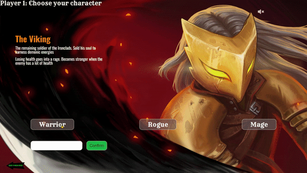
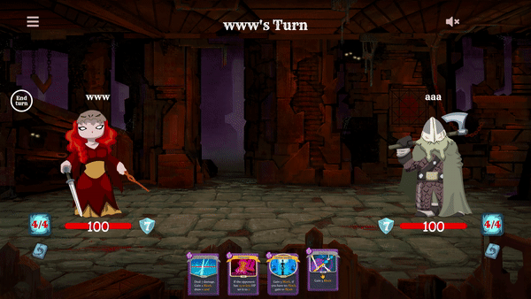

<h1 align="center">Card Builder Game</h1> 

## Intro
Hey, my name is **Nick**, i'm a beginner Front-end Dev and  this is my first "big" project. 
I was inspired by ["Slay the spire"](https://store.steampowered.com/app/646570/Slay_the_Spire/) game and try to build the same mini game-project on JS.
Thank you and enjoy.

## Description

The main goal is defeat your opponent by playing cards which can do damage, defend you and some of them 
have additional effects.

The game starts with a choice, each player chooses characters and nicknames.

Each character has **12 unique cards**, but you can choose a few of them for battle.
The card requires _**Stamina**_ so be careful when choosing the card you want to play.

## How to play

<h2 align="center">You can try a [Live Demo](https://awayawayaway.github.io/MateevskiyGameProject/) </h2>

### Drag and Drop [Chrome, Opera, Firefox, Edge]:
* **Drag** Card into "dropzone",
* **Drop** it within "dropzone" for activate card's effect

### Swipe [for mobiles and tablets]
* Touch card you want to play and just **swipe up**

## About project

The game is made as _Single Page Application_.
What technologies are used here:

* **ES5, ES6** (destructuring, closures, array functions, rest pattern, modules, forEach, map etc.)
* **Mutation observer**
* **SASS**
* **OOP**
* **MVC pattern**
* **Fetch API** (you can save your progress and continue from other device)
* **Webpack** (devServer, MiniCssExtracter, css|sass|postcss loaders, babel)

Contributing are welcome.
You always can contact me on [twitter](https://twitter.com/Nikolay08474464) or email.
